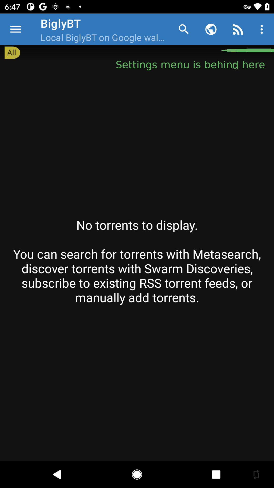
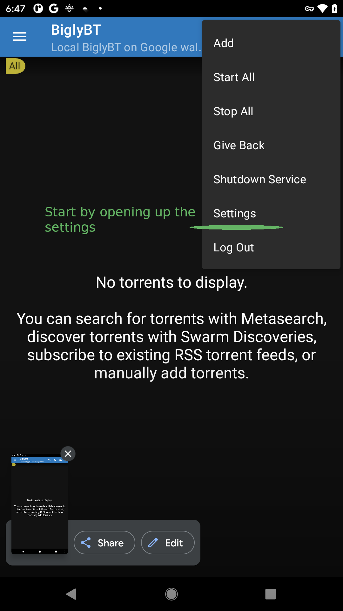
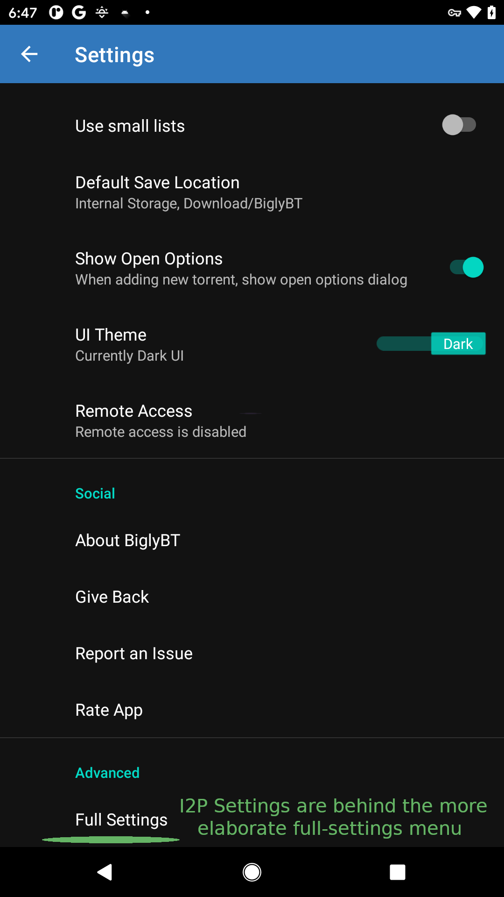
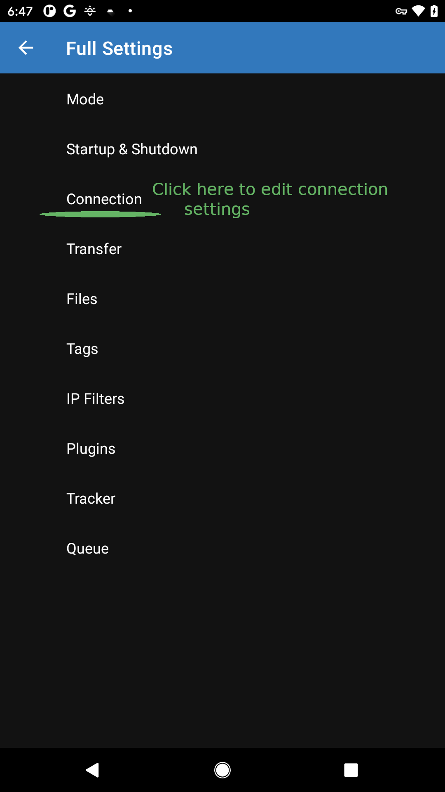
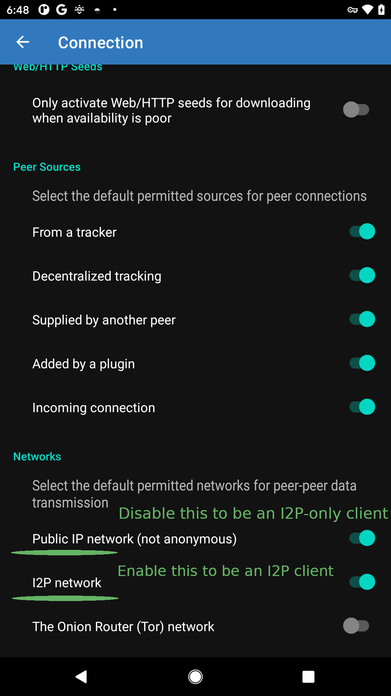

How to download using I2P and BiglyBT for Android
=================================================

In a release this year, the BiglyBT port to Android gained support for
downloading torrents via I2P. While the configuration is somewhat difficult to
find, it's quite straightforward to enable.

BiglyBT for Android is available via the:

 - [Google Play Store](https://play.google.com/store/apps/details?id=com.biglybt.android.client)
 - [F-Droid Main Repository](https://f-droid.org/en/packages/com.biglybt.android.client), and 
 - [Github Releases](https://github.com/BiglySoftware/BiglyBT-Android)

Download and install BiglyBT from your preferred source and you will be ready to begin.

 1. BiglyBT for Android has a range of settings and menus. The entrypoint for all the
  menus is this icon in the top-right corner.
  - 
 2. Choose the "Settings" item from the menu that appears. This will open a basic version
  of the settings menu.
  - 
 3. I2P settings are part of the "Full Settings" menu, and the full-settings menu is at the
  bottom of the list.
  - 
 4. One more menu deep is the "Connection Settings." Open this menu to enable different
  kinds of connections.
  - 
 5. Finally, scroll to the bottom of the menu and flip the switch to enable I2P.
  - 

